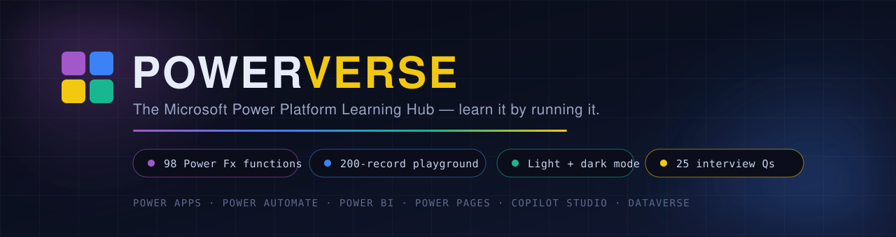

# POWERVERSE — The Microsoft Power Platform Learning Hub

<p align="center">
  
</p>

<p align="center">
  <a href="https://lellasriharsha.github.io/power-platform-hub/"><b>🚀 Open the live playground</b></a>
  &nbsp;·&nbsp;
  <a href="https://lellasriharsha.github.io/power-platform-hub/#functions">📚 98-function reference</a>
  &nbsp;·&nbsp;
  <a href="https://lellasriharsha.github.io/power-platform-hub/#interview">💼 Interview prep</a>
  &nbsp;·&nbsp;
  <a href="https://lellasriharsha.github.io/power-platform-hub/#scenarios">🏗️ Real scenarios</a>
</p>

<p align="center">
  <a href="https://lellasriharsha.github.io/power-platform-hub/"></a>
  <a href="LICENSE"></a>
  
  
  
  
</p>

<p align="center">
  
  
  
  
  
</p>

<h3 align="center">Everything you need to learn Microsoft Power Platform — in one page you can actually <i>run</i>.</h3>

<p align="center">
  Live Power Fx playground · searchable function reference · code library · real-world architectures · interview prep · light &amp; dark mode
</p>

---

### 🔗 Live site

| Edition | URL | What it is |
|---|---|---|
| **v2 — app build** (default) | **https://lellasriharsha.github.io/power-platform-hub/** | React 19 + TanStack Start shell, light/dark mode, worker-sandboxed JS playground |
| **v1 — classic single file** | https://lellasriharsha.github.io/power-platform-hub/classic/ | The original zero-dependency HTML/CSS/JS edition, kept for reference |

---

## 📖 Table of contents

- [What's inside](#-whats-inside)
- [The playground](#-the-playground)
- [What's new in v2](#-whats-new-in-v2)
- [Tech stack](#-tech-stack)
- [Repository layout](#-repository-layout)
- [Run it locally](#-run-it-locally)
- [Publishing: how the live site updates](#-publishing-how-the-live-site-updates)
- [Security model](#-security-model)
- [Certifications (2026)](#-certifications-verified-for-2026)
- [Contributing](#-contributing)
- [Credits](#-credits)
- [Disclaimer & license](#-disclaimer)

---

## ✨ What's inside

| # | Section | What you get |
|---|---|---|
| 01 | 🧭 **The Platform** | All six products — Power Apps, Power Automate, Power BI, Power Pages, Copilot Studio and Dataverse. Click any tile for capabilities, languages, certification mapping and official Microsoft Learn links. |
| 02 | 🎓 **Learning Path** | A five-step route from first app to solution architect, mapped to **current 2026 certifications** (including which exams are retiring). |
| 03 | 🎮 **Live Playground** | A real **Power Fx engine written from scratch** — tokenizer → parser → evaluator → formatter. IntelliSense, syntax highlighting, line numbers, function help and a dataset viewer. |
| 04 | 🧩 **Code Library** | Copy-ready snippets: Power Fx, Power Automate expressions & OData, DAX, Power Query M, Dataverse Web API, JavaScript form scripts and Liquid. |
| 05 | 📚 **Fx Function Reference** | **98 Power Fx functions** — syntax, plain-English description and a **runnable example** for each, searchable and filterable by category. |
| 06 | 🏗️ **Real-Life Scenarios** | 6 production architectures across HR, Finance, Retail, Public Sector, Manufacturing and Legal, each with an expandable build breakdown. |
| 07 | 🎯 **Interview Prep** | 25 real interview questions with model answers, difficulty tags and topic filters. |
| 08 | 📦 **Resources** | Official docs, community links, essential tooling and the certification ladder. |

---

## 🎮 The playground

The centrepiece: type Power Fx, hit **RUN**, and watch it evaluate against live data — no sign-in, no backend, no build step.

- **98 Power Fx functions** across Text, Math, Date & Time, Logic, Table and Behaviour categories
- **Two 100-record datasets** (`Employees`, `Orders`) from a seeded generator — dates, decimals, booleans and deliberate `Blank()` cells
- **IntelliSense** popup with live signatures — `↑`/`↓` navigate, `Tab`/`Enter` accept, `Esc` dismiss
- **? help** — explains the function under your cursor, with a valid example you can run in one click
- **🗄 data** — browse both datasets in a table, `Blank()` cells included
- **Structured code view** — line numbers + syntax highlighting
- **Records and tables** — `{Name: "Ada"}` and `[1, 2, 3]`, with `;` statement chaining
- **⌘/Ctrl + Enter** to run; every reference card can push its example straight into the editor

---

## 🚀 Run it locally

### 1. Just browse the built site (no tooling required)

```bash
git clone https://github.com/LellaSriHarsha/power-platform-hub.git
cd power-platform-hub
open docs/index.html                 # macOS
# xdg-open docs/index.html           # Linux
# start docs\index.html              # Windows
```

A local server is slightly better (clipboard, Web Worker and fonts behave exactly like production):

```bash
cd docs && python3 -m http.server 8000     # then open http://localhost:8000
```

### 2. Work on the app source (React + TanStack Start)

The editable source lives in [`app/`](app/). Bun is what Lovable uses; npm works too.

```bash
cd app

bun install && bun run dev           # http://localhost:8080
# or
npm install && npm run dev

bun run build                        # production build
bun run lint                         # eslint
bun run format                       # prettier
```

> The React shell renders a loading state and hands off to the self-contained
> `powerverse.html` bundle, which is where the playground actually runs.

---

## 🆕 What's new in v2

| Area | v1 — classic | v2 — current |
|---|---|---|
| **Delivery** | One `index.html`, hand-rolled CSS | React 19 + TanStack Start shell; static build published from `docs/` |
| **Theming** | Dark only | **Light & dark mode**, remembers your choice, follows your OS by default |
| **JS playground** | Ran in page context | Runs in a dedicated **Web Worker**, hard-stopped after 2 s |
| **Security** | Escaped output | Escaping **plus** a restrictive Content-Security-Policy |
| **Structure** | Everything inline | Source in `app/`, publishable build in `docs/`, classic edition preserved in `docs/classic/` |
| **Tooling** | None | TypeScript, ESLint, Prettier, Tailwind 4, shadcn/ui primitives |

The Power Fx engine, the 98-function reference, the seeded datasets, the snippets, the scenarios
and the interview bank all carried over — v2 is the same content in a sturdier shell.

---

## 🧱 Tech stack

| Layer | Choice |
|---|---|
| **Framework** | React 19 with [TanStack Start](https://tanstack.com/start) (file-based routing, SSR-capable shell) |
| **Styling** | Tailwind CSS 4 + shadcn/ui (Radix primitives) |
| **Language** | TypeScript 5 |
| **Build** | Vite 7 via `@lovable.dev/vite-tanstack-config`, Nitro for the server target |
| **Playground** | Dependency-free Power Fx engine (tokenizer → parser → evaluator → formatter) + a Web Worker for JavaScript examples |
| **Data** | Seeded, deterministic generators — 100 `Employees` + 100 `Orders` |
| **Hosting** | GitHub Pages (branch deploy from `docs/`) |
| **Authoring** | Built with [Lovable](https://lovable.dev) |

---

## 🗂 Repository layout

```
power-platform-hub/
├── docs/                       # ← GitHub Pages serves this folder
│   ├── index.html              #   the published app (self-contained bundle)
│   ├── js-runner.js            #   Web Worker used by the JS playground
│   ├── favicon.ico
│   ├── robots.txt
│   ├── .nojekyll               #   serve the files as-is, no Jekyll processing
│   └── classic/
│       └── index.html          #   v1 single-file edition, preserved
├── app/                        # editable source (React 19 + TanStack Start + Tailwind 4)
│   ├── src/
│   │   ├── routes/             #   router entry + the shell that hands off to the app bundle
│   │   ├── components/ui/      #   shadcn/ui primitives
│   │   ├── lib/                #   error capture + helpers
│   │   └── styles.css
│   ├── public/
│   │   ├── powerverse.html     #   the self-contained app bundle
│   │   └── js-runner.js
│   ├── package.json
│   ├── vite.config.ts
│   └── tsconfig.json
├── assets/
│   └── banner.svg              # README hero artwork (hand-authored SVG)
├── scripts/
│   └── sync-from-lovable.sh    # pull the newest Lovable build into docs/ + app/
├── README.md
├── LICENSE
└── .gitignore
```

### Engine architecture

| Piece | Responsibility |
|---|---|
| `fxTok()` | Tokenizer — strings, numbers, identifiers, operators, comments |
| `fxParse()` | Precedence-climbing parser producing an AST |
| `fxEval()` | Tree-walking evaluator with a scope chain for records, tables and lambda rows |
| `fxShow()` | Type-aware output formatter (tables render as grids, `Blank()` is labelled) |
| `FN[]` | Single source of truth for the reference grid, IntelliSense and the help modal |
| `FX_DATASETS` | Deterministic 100 + 100 record datasets shared by every function example |


---

## 📜 Certifications (verified for 2026)

| Exam | Status | Notes |
|---|---|---|
| **PL-900** | ✅ Live | Power Platform Fundamentals — never expires |
| **AB-900** | ✅ Live (new) | Copilot & Agent Administration Fundamentals — the AI track |
| **PL-300** | ✅ Live | Power BI Data Analyst Associate |
| **PL-400** | ✅ Live | Power Platform Developer Expert |
| **PL-500** | ⚠️ Retires 30 Jun 2026 | Power Automate RPA Developer |
| **PL-600** | ⚠️ Retires 30 Jun 2026 | Power Platform Solution Architect Expert |
| **PL-200** | ⚠️ Retires 31 Aug 2026 | Power Platform Functional Consultant |
| PL-100 | ❌ Retired (2024) | Replaced by Applied Skills credentials |
| MS-900 · MB-910 · MB-920 | ❌ Retired | Fundamentals layer reshaped around the AB family |

Associate/expert certifications renew free each year via an online assessment; fundamentals do not expire.

---

## 📦 Publishing: how the live site updates

GitHub Pages is configured to **deploy the `docs/` folder from `main`**:

> **Settings → Pages → Source: Deploy from a branch → `main` → `/docs`**

So the publish rule is simple: **whatever lands in `docs/` is what the world sees.**

### Coming from Lovable?

Lovable keeps its own working copy in a separate private repository, so this repo includes a sync helper:

```bash
./scripts/sync-from-lovable.sh
```

It clones the Lovable export, copies the static build into `docs/`, mirrors the source into `app/`,
then commits and pushes — GitHub Pages redeploys about a minute later.

```bash
# point it at a different Lovable repo if you ever recreate the project
./scripts/sync-from-lovable.sh https://github.com/<user>/<lovable-repo>.git
```

### Manual publish

```bash
# 1. copy the new build into docs/ (keep docs/classic untouched)
rsync -a --exclude 'classic' /path/to/lovable/docs/ docs/

# 2. ship it
git add -A && git commit -m "chore: publish latest build" && git push
```

### Notes

- `.nojekyll` is present so Pages serves the bundle verbatim.
- The app is a single self-contained `index.html`, so it works at any subpath — including
  `/power-platform-hub/` — with no base-path configuration.
- The React shell in `app/src/routes/index.tsx` resolves its hand-off target relative to the
  current document rather than the domain root, so it also works from a project subpath.

---

## 🔒 Security model

- Power Fx formulas are evaluated by a **limited local interpreter** against generated sample data.
- JavaScript examples run in a **dedicated Web Worker**, never in the page context, and are stopped after 2 seconds.
- All dynamic playground output is **escaped** before display.
- A restrictive **Content-Security-Policy** limits scripts, connections, objects and embedding.
- **No user data is collected** or sent to any server — everything happens in your browser.

The JavaScript playground is an educational tool, not a production sandbox. Don't paste secrets or untrusted code into it.


---

## 🤝 Contributing

Issues and PRs are welcome. Good places to start:

- **New Power Fx functions** — add an entry to the `FN[]` reference data *and* the matching `case` in the evaluator, then publish the rebuilt bundle to `docs/`
- **More scenarios or interview questions** — the platform grows every release (agents, Fabric, Dataverse MCP)
- **Engine parity improvements** — delegation warnings, collection persistence, `JSON()`, `Choices()`, `ParseJSON()`
- **Accessibility** — keyboard traps, focus order in the modals, contrast in light mode
- **Docs** — corrections, better examples, anything unclear

Conventions:

1. Content changes must be mirrored in **both** `app/public/powerverse.html` and `docs/index.html` (or run the sync script).
2. Keep the playground dependency-free — the Power Fx engine stays plain JavaScript.
3. Run `bun run lint` inside `app/` before opening a PR.
4. Describe the "why" in your PR body; screenshots help for UI changes.

### Found a bug?

Open an issue with the formula you ran, what you expected, and what happened. The engine is a
subset implementation, so "function X isn't supported yet" is a valid, useful report.

---

## 🙏 Credits

- Content and the original Power Fx engine — [SriHarsha](https://github.com/LellaSriHarsha)
- v2 application shell and design iteration — built with [Lovable](https://lovable.dev)
- Function semantics based on the official [Microsoft Power Fx documentation](https://learn.microsoft.com/power-platform/power-fx/)
- Fonts served by Google Fonts: Chakra Petch, Instrument Sans, JetBrains Mono

If this helped you pass an exam or ship your first app, a ⭐ on the repo is the best thank-you.

---

## ⚖️ Disclaimer

This is an **unofficial, community-built** learning resource and is not affiliated with or endorsed by Microsoft. Microsoft, Power Platform, Power Apps, Power Automate, Power BI, Power Pages, Copilot Studio and Dataverse are trademarks of Microsoft Corporation. Certification details reflect publicly available information as of **2026** — always confirm on Microsoft Learn before booking an exam.

---

## 📄 License

MIT — free to use, fork, teach with and remix. See [LICENSE](LICENSE).

